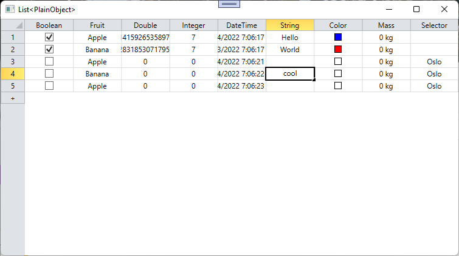

## Galador.ExcelGrid

This code is a rework and trim down of that other GitHub repository:
https://github.com/PropertyTools/PropertyTools

I extracted only the code relevant to their (Excel like) DataGrid, targeted .NET6, renamed a few namespace and voila.
Aiming for a simple, self contained spreadsheet control looking like Excel.

I also added their original WPF samples (*ExcelGridDemo*).
And added a sample to experiment with the data model I was aiming for: *SimpleGrid*.

**Remark** Of note I cut some of their all their controls (but the DataGid), hence the default color editor is no loger editing colors.

**Remark** maybe one day add formula with Lua?
(https://www.moonsharp.org/)
